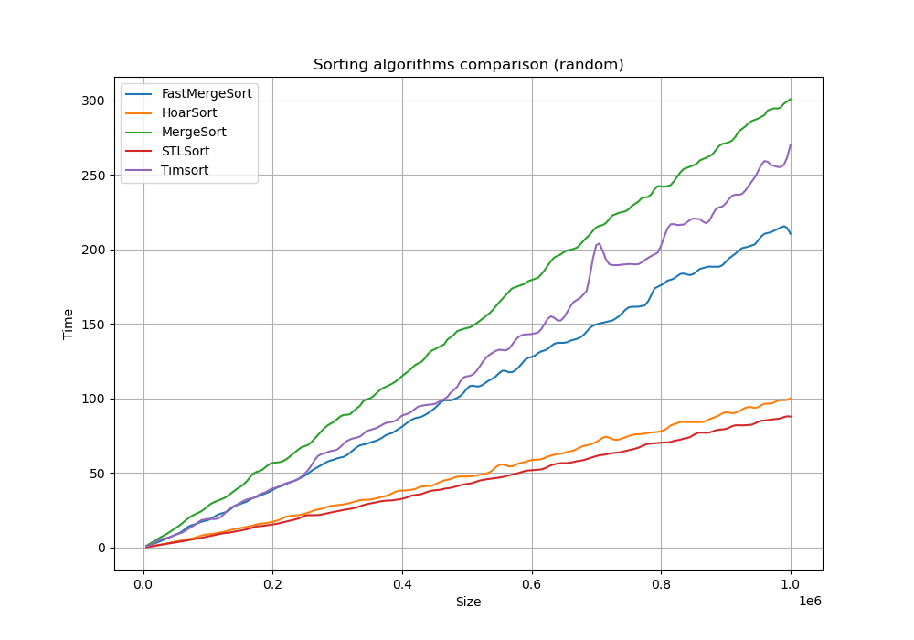
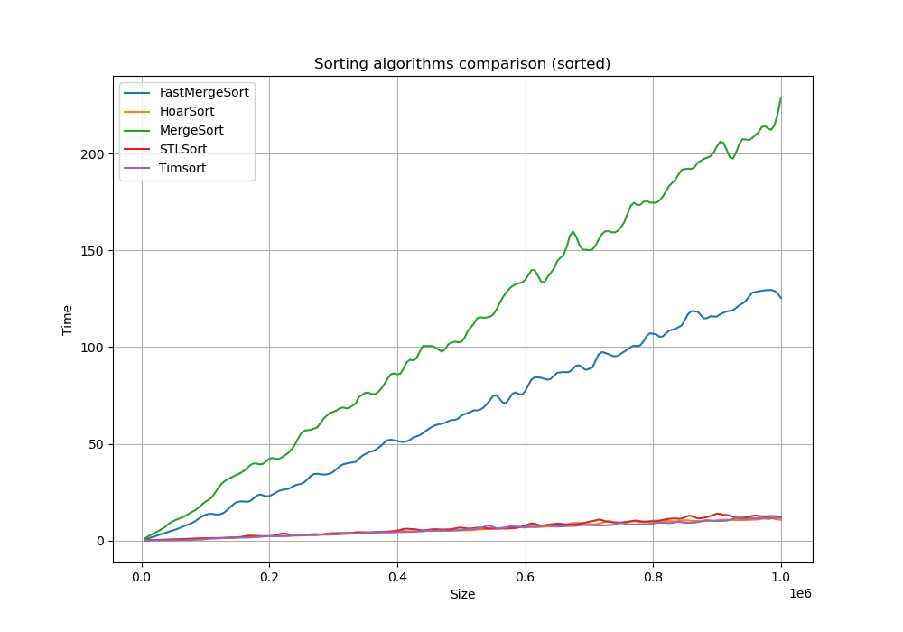

Реализация на языке C++ различного вида сортировок:
- Сортировка вставками (InsertSort),
- Сортировка подсчётом (CountSort),
- Сортировка слиянием с рекурсией (MergeSort),
- Сортировка слиянием без рекурсии (FastMergeSort),
- Сортировка двоичными вставками (InsertBinarySort)
- Хоара (HoarSort),
- TimSort.

Для тестирования был написан генератор массивов 4 видов:
- Из рандомных чисел
- Отсортированный
- Отсортированный в обратном порядке
- "Испорченный" отсортированный массив (после сортировки производится небольшое количество перестановок в массиве)

Результаты:

Массив из рандомных чисел: \

Отсортированный массив: \

Отсортированный в обратном порядке массив: \

"Испорченный" отсортированный массив: \

